# 3PhotoLib

### The royalty-free photo delivery platform for free-forever use!

   

**NOTE#1:     This is a non-commercial project which returns some images based on the user search input. Note that the app is currently in development mode, so stay tuned for the final release soon!**

 

**NOTE#2:     The project is available as a pre-release version at: https://threephotolib.vercel.app/  Since most of the features are completed by now, the project is deployed in its current version, which will be updated regularly.**

 

**NOTE#3:     In its' current state, the project is not responsive for large screens / desktops. The layout will be supporting larger devices soon. For now, if you want to preview the app in such devices, visit https://threephotolib.vercel.app/  and then press CTRL + SHIFT + I  and CTRL + SHIFT + M afterwards. That way you can emulate the project from mobile device perspective.**

 

 
 

### The purpose of an app

  

• 3PhotoLib is an online photo library, which allows you to view, save and download royalty-free images, whether for personal or commercial use. After setting up an account and successfully verifying it, you can search for photos of any kind through 3 of our Providers: Pixabay, Pexels and Unsplash.

 

• You can fully manage the photos - that is: liking/unliking them, creating a separate 'containers' (known as collections), moving or cloning photos from one collection to another, and much more!

 

• You can view each individual image in detailed mode, which showcases the photo author, the photo provider with appropiate links and will give more detailed information about the image itself. 

   

### Preview video

   

### Project showcase

   

1) Landing Page

 

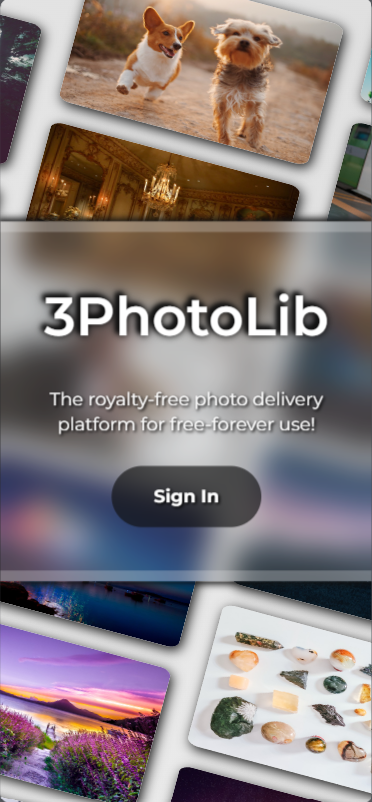

 

 

 

2) Sign In Page

 

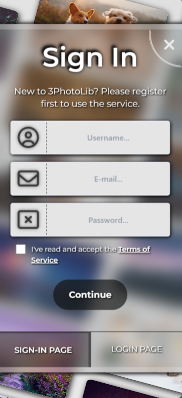

 

 

 

3) Home Page

 

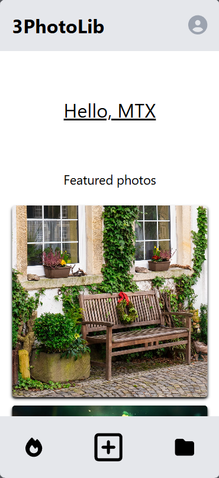

 

 

 

4) Search results Page

 

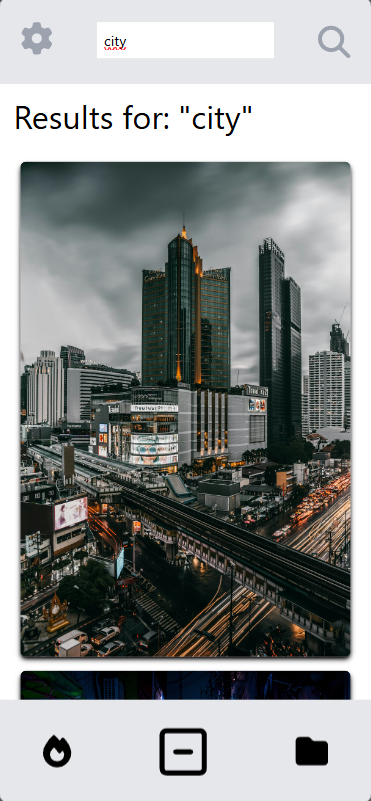

 

 

5) Search options

 

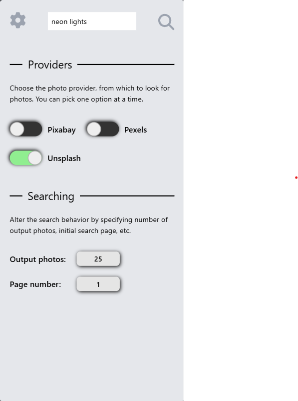

 

 

 

6) Detailed photo page (1/2)

 

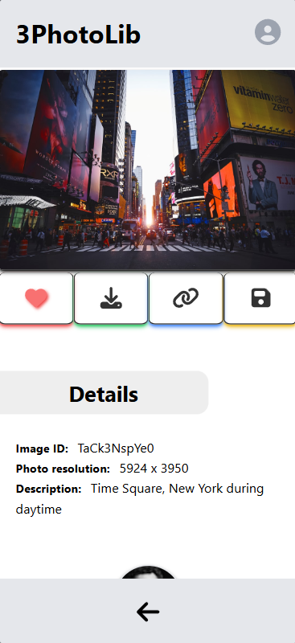

 

 

 

7) Detailed photo page (2/2)

 

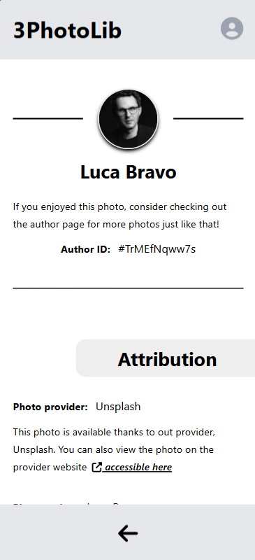

 

 

 

8) Liked Photos Page

 

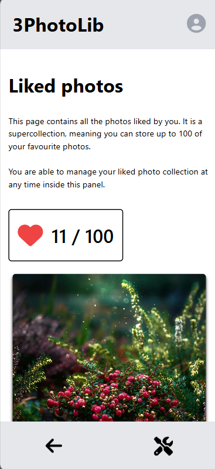

 

 

 

9) User Collections Page

 

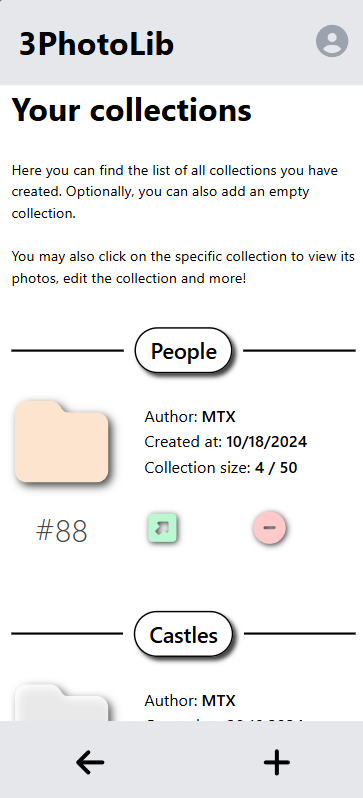

 

 

 

10) Collection Photos Page

 

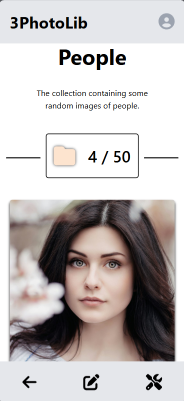

 

 

 

11) Save To Collection Form

 

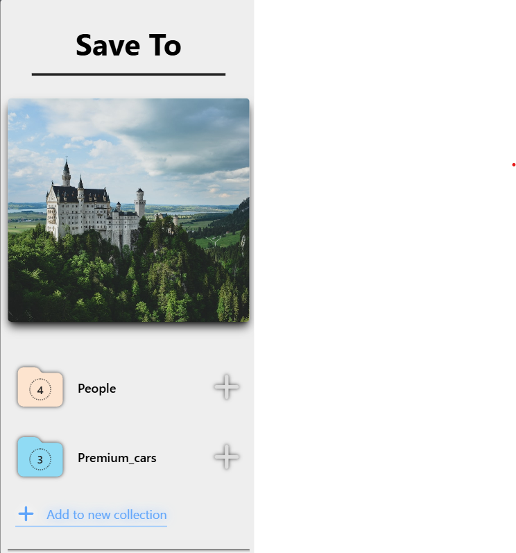

 

 

 

12) Add New Collection Form

 

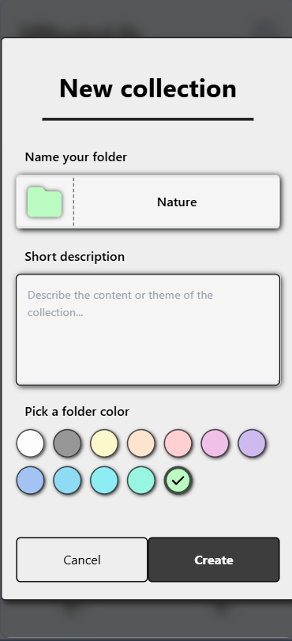

 

 

 

13) Delete Collection Page

 

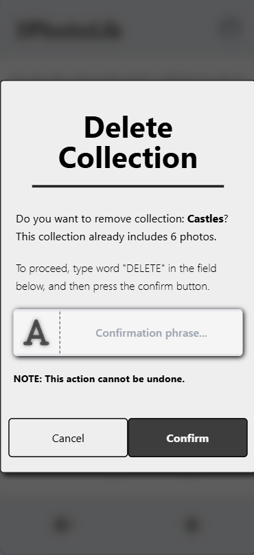

 

 

 

14) User Account Page

 

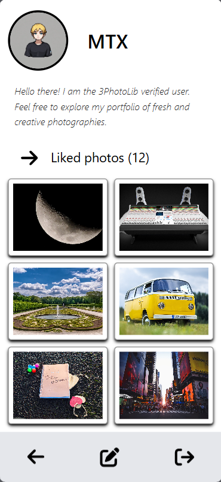

 

 

 
 
 

### Tools

 

This project was created using these tools:

  

- Node.js
- Vue 3 
- Nuxt 3
- Typescript
- Pinia
- FontAwesome
- Prisma
- PostgreSQL
- Supabase
- Google SMTP
- Vercel
- Vite
- TailwindCSS

   

**Special thanks & huge shoutout for Pixabay, Pexels and Unsplash for their amazing photos!**

  

© Martimex 2024

