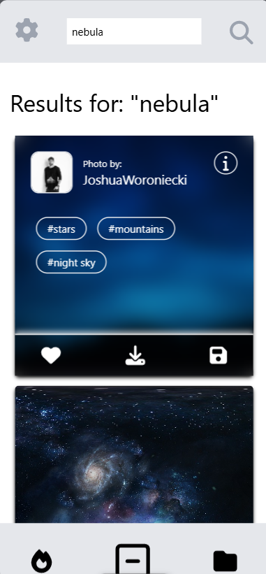
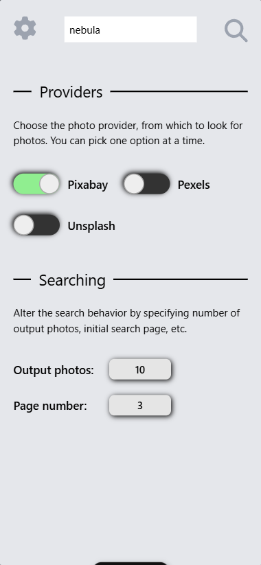
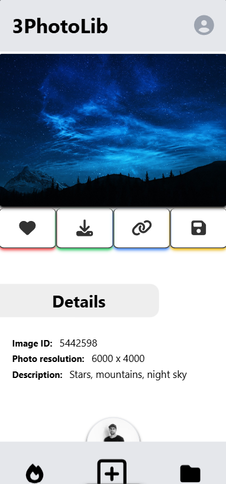
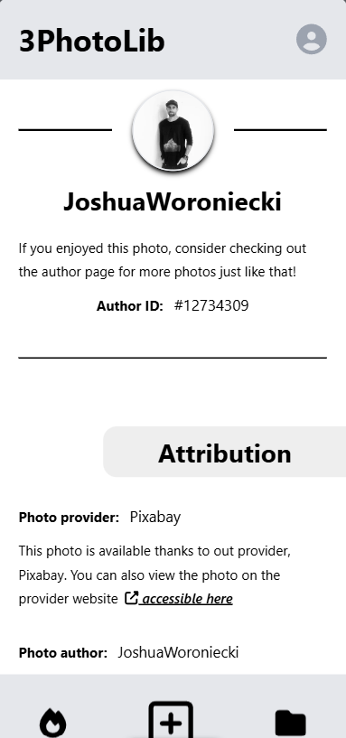

# 3PhotoLib

### The royalty-free photo delivery platform for free-forever use!

   

**This is a non-commercial project which returns some images based on the user search input. Note that the app is currently in development mode, so stay tuned for the final release soon!**

 

• The app will allow users not only to search for photos, but also to "heart" them (internally, within the app)    
• There will be possible to create & manage photo collections, where user can "save" and store images that he / she finds interesting.    
• Photos - most likely - will be downloadable.    
• User can view each individual image in detailed mode, which showcases the photo author, the photo provider with appropiate links and will give more detailed information about the image itself.    

   

### Project showcase

   

1) Search results page

 

 

 

 

2) Advanced search options menu

 

 

 

 

3) Detailed Photo page (1/2)

 

 

 

 

4) Detailed Photo page (2/2)

 

 
